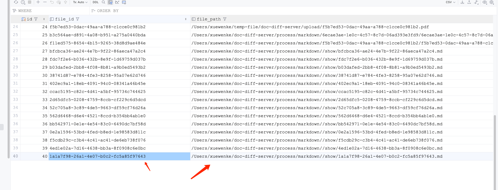

# 文档比对

# 服务启动的准备

## 文档站换工具的安装

### minerU
https://github.com/opendatalab/MinerU

### docx2md
pip install docx2md

## 修改目录配置
打开 application-local.yml  配置文件
修改 local 下的所有目录

## 脚本放置
将 /resources/filesstore/script/ 目录下的脚本 放置到 application-local.yml 配置的script目录下

## 启动服务
直接 run  DocDiffServerApplication 的 main 方法即可

## 数据库说明

### 数据库表 
contract_diff_task  任务表

contract_diff_task_detail 任务详情表 用来存储任务比对结果

file_store 文件存储表 管理上传的文件

## 接口说明

### 比对结果详情
调用比对结果详情接口，会去读 contract_diff_task_detail 的 compare_result 字段。这个字段存储的是比对结果的 json 字符串。
json 字符串里有两个文件字段 cmpFileId 和  stdFileId。这两个 Id 对应着两个文件， 这两个文件放在  src/main/temp-file/show/ 

但是文件读取路径在表file_store 的 file_path 字段中。 所以得去修改file_path 字段的值， 让它指向 到到自己定义目录下的文件。

